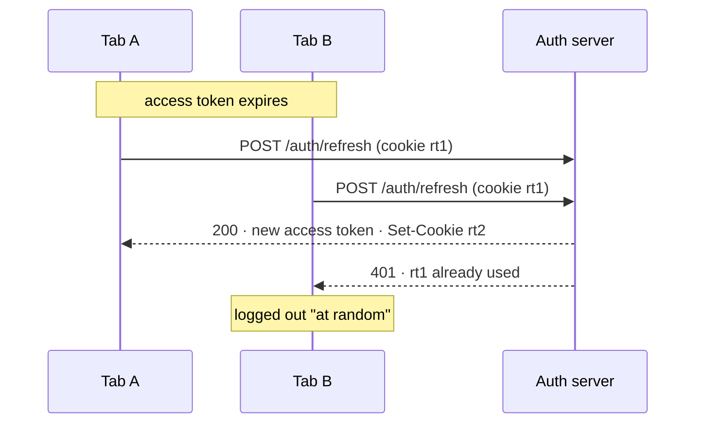
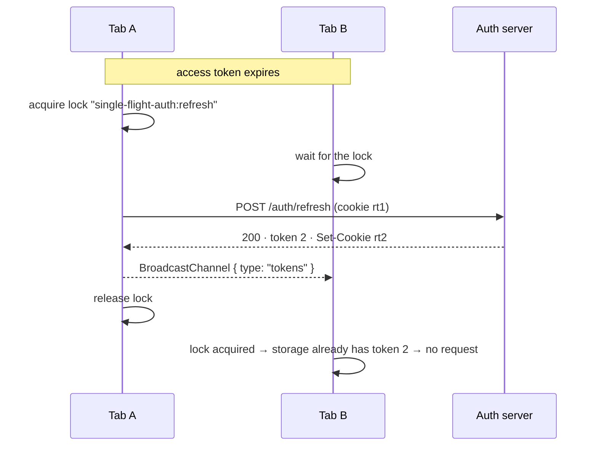

# single-flight-auth

Single-flight access-token refresh **within a tab and across tabs**. Fixes the "random 401 / random
logout" that refresh-token rotation causes when two tabs refresh at the same time.

[](https://www.npmjs.com/package/single-flight-auth)
[](https://github.com/ilia-muravev-dev/single-flight-auth/actions/workflows/ci.yml)
[](https://bundlephobia.com/package/single-flight-auth)
[](./LICENSE)

Zero dependencies · ~2.3 kB brotli · ESM + CJS · TypeScript · works in browsers and Node.

## The bug

Your API issues short-lived access tokens and rotates the refresh token on every refresh, which is
the right thing to do. A user has the app open in two tabs. The access token expires; both tabs
notice; both call `/auth/refresh` with the same refresh token. The server consumes it for the first
request and rejects the second — and that tab is logged out. The user reports "I get logged out at
random"; the logs show nothing but a 401. I spent a week on exactly this once.



`single-flight-auth` makes the refresh happen once: concurrent callers in a tab share one promise,
and tabs take turns through the [Web Locks API](https://developer.mozilla.org/en-US/docs/Web/API/Web_Locks_API).
The tab that gets the lock second finds the new token already in storage and skips the request.



## Install

```bash
npm install single-flight-auth
```

## Use

```ts
import { createAuthClient, SessionLostError } from 'single-flight-auth';

export const auth = createAuthClient({
  // Called at most once at a time — per tab and, with the lock, across tabs.
  refresh: async () => {
    const response = await fetch('/auth/refresh', { method: 'POST', credentials: 'include' });
    if (!response.ok) throw response; // 401/403 → session lost; anything else → transient
    const { accessToken, expiresIn } = await response.json();
    return { accessToken, expiresAt: Date.now() + expiresIn * 1000 };
  },
  storage: 'localStorage', // share the access token between tabs (default: 'memory')
  onSessionLost: () => location.assign('/login'),
});

// Right after login:
await auth.setTokens({ accessToken, expiresAt });

// Anywhere else: attaches the token, refreshes when it is about to expire,
// and on a 401 refreshes once and retries once.
const me = await auth.fetch('/api/me');

// Or just the token, for a client that builds its own requests:
const token = await auth.getAccessToken();
```

## What you get

- **One refresh per tab**: concurrent `getAccessToken()` / `fetch()` calls share the in-flight promise.
- **One refresh across tabs**: an exclusive Web Lock; a `localStorage` lease where Web Locks are
  missing; a double-check inside the lock so the second tab reuses the first tab's token.
- **Tabs stay in sync**: refreshes, `setTokens()`, `clear()` and lost sessions are broadcast.
- **Proactive refresh**: tokens within `expirySkewMs` (30 s) of expiry are refreshed before use.
- **401 handling**: `auth.fetch` refreshes once and retries once, resending the body; a second 401
  is returned to you.
- **Session-lost semantics**: a 401/403 from `refresh()` clears the tokens everywhere and calls
  `onSessionLost` once per tab; network errors keep the tokens and are simply rethrown.
- **Node too**: in-process single flight everywhere, and Web Locks on Node 24+ — useful for
  service-to-service token caches.

## Proof

`pnpm e2e` builds the library, starts a mock auth server with refresh-token rotation
([`test/e2e/mock-server.ts`](./test/e2e/mock-server.ts)), opens **five tabs** in Chromium, lets the
access token expire and calls the API from all five at the same moment. Output of
[`test/e2e/race.spec.ts`](./test/e2e/race.spec.ts):

| Scenario | Refresh calls | Rejected by server | Tabs logged out |
| --- | ---: | ---: | ---: |
| no lock, no channel (the bug) | 5 | 4 | **4** |
| Web Locks + `localStorage` | **1** | 0 | 0 |
| `localStorage` lease fallback | 1 | 0 | 0 |
| Web Locks + `memory` storage + channel | 2 | 0 | 0 |
| no lock, server grace period 2 s | 5 | 0 | 0 |

The same race is also reproduced in-process in
[`test/unit/client.test.ts`](./test/unit/client.test.ts) ("the race, in one process") against a
model of a rotating server, so it runs in under a second without a browser.

## Why the server needs a grace period too

The lock removes the common race, but a rotated refresh token can still be presented twice when a
tab closes after its request reached the server but before the response arrived, when a proxy or
middleware serves a cached response carrying an old `Set-Cookie`, or when a request from before the
refresh is still in flight. So, on the server:

```ts
// POST /auth/refresh — sketch
const record = await refreshTokens.find(presented);
if (!record) return unauthorized();
if (record.consumedAt) {
  const withinGrace = Date.now() - record.consumedAt < 30_000;
  if (withinGrace) return ok(record.successor);   // a raced tab: hand out the same new tokens
  await refreshTokens.revokeFamily(record);         // reuse after the window: treat as theft
  return unauthorized();
}
await refreshTokens.consume(record);                // atomically, before anything slow
return ok(await issueSuccessor(record));
```

The last row of the table shows a grace period alone also prevents logouts — at five refreshes
instead of one. Use both. See [ADR 0002](./docs/adr/0002-the-server-still-needs-a-grace-period.md).

### Gotchas seen in production

- **Cached cookies.** Make `/auth/refresh` responses `Cache-Control: no-store`, and make sure no
  middleware rewrites cookies from a cached response. A Next.js middleware that forwarded a cached
  `Set-Cookie` was half of the original week-long bug.
- **Clock skew.** `expiresAt` is compared with `Date.now()` in the browser. Derive it from
  `expiresIn` (a duration) rather than from an absolute server timestamp.
- **Memory storage after reload.** With `storage: 'memory'` a reload starts with a refresh
  (`reason: 'missing'`), which is exactly what you want when the refresh token is an httpOnly cookie.

## API

### `createAuthClient(options)`

| Option | Default | What it does |
| --- | --- | --- |
| `refresh(context)` | required | Returns `{ accessToken, expiresAt }`. `context.previous` is the token set that triggered the refresh, `context.reason` is `'missing' \| 'expired' \| 'unauthorized' \| 'manual'`. Throw a `Response` (or `{ status }`) with 401/403 to signal a lost session. |
| `storage` | `'memory'` | `'memory'`, `'localStorage'`, `'sessionStorage'` or a custom `TokenStorage` (sync or async). Web Storage falls back to memory when unavailable. |
| `storageKey` | `'single-flight-auth:tokens'` | Key for the Web Storage adapters. |
| `lock` | `'auto'` | `'auto'`, `'web-locks'`, `'lease'`, `'none'` or a custom `RefreshLock`. |
| `lockName` | `'single-flight-auth:refresh'` | Name of the Web Lock / lease. Use one per user session if several clients coexist. |
| `channel` | `'single-flight-auth'` | `BroadcastChannel` name, a custom `TokenChannel`, or `false`. |
| `expirySkewMs` | `30_000` | Refresh proactively when the token expires within this window. |
| `leaseTtlMs` | `10_000` | Lease fallback only: how long a lease may be held before it counts as abandoned. |
| `isSessionLost(error)` | 401/403 | Classifies errors thrown by `refresh()`. |
| `onSessionLost(error)` | — | Called once per lost session, in every tab. |
| `fetch` | `globalThis.fetch` | Implementation used by `client.fetch`. |
| `attachToken(request, token)` | `Authorization: Bearer` | Customise how the token travels. |
| `retryOn401` | `true` | Refresh once and retry once when a response is 401. |
| `now()` | `Date.now` | Clock, for tests. |

### `AuthClient`

| Method | Behaviour |
| --- | --- |
| `getAccessToken({ forceRefresh? })` | Fresh token, refreshing first if needed. |
| `getTokens()` | Stored token set or `null`; never refreshes. |
| `refresh()` | Forces a refresh (still single-flight and locked). |
| `fetch(input, init?)` | `fetch` with the token attached and the 401-retry behaviour. |
| `setTokens(tokens)` | Store tokens obtained elsewhere (after login) and tell other tabs. |
| `clear()` | Forget the tokens in every tab, without calling `onSessionLost`. |
| `subscribe(listener)` | Observe token changes; returns an unsubscribe function. |
| `dispose()` | Close the channel; the client cannot be used afterwards. |

`SessionLostError` (with `cause` set to the original error) is what waiting callers receive when a
refresh is rejected.

Lower-level pieces are exported for custom setups: `singleFlight`, `memoryStorage`, `webStorage`,
`broadcastChannel`, `webLocksLock`, `leaseLock`, `noLock`, `isTokenSet`.

### Keeping the refresh token in JavaScript

Prefer an httpOnly cookie. If you must hold the refresh token in the client, extend the token set —
and know that `localStorage` makes it readable by any script that runs on your origin:

```ts
interface MyTokens { accessToken: string; expiresAt: number; refreshToken: string }

const auth = createAuthClient<MyTokens>({
  refresh: async ({ previous }) => post('/auth/refresh', { refreshToken: previous?.refreshToken }),
});
```

## How it works

1. `getAccessToken()` reads storage. A token that is fresh (outside the skew window) is returned.
2. Otherwise the refresh goes through `singleFlight`: concurrent callers in this tab await the same
   promise.
3. The refresh acquires the cross-tab lock, then **re-reads storage**. If another tab stored a
   different, fresh token meanwhile, it is returned without a request.
4. Otherwise `refresh()` runs; the result is validated, stored, broadcast (`{ type: 'tokens' }`)
   and returned.
5. If `refresh()` throws and `isSessionLost(error)` is true, storage is cleared,
   `{ type: 'session-lost' }` is broadcast and every tab calls `onSessionLost` once. Any other
   error keeps the tokens and is rethrown.

Design notes live in [`docs/adr`](./docs/adr).

## Browser and runtime support

| Capability | Where | Without it |
| --- | --- | --- |
| Web Locks | Chrome 69, Firefox 96, Safari 15.4, Node 24 | `localStorage` lease (best effort) |
| BroadcastChannel | Chrome 54, Firefox 38, Safari 15.4, Node 18 | tabs only sync through shared storage |
| `fetch` / `Request` | everywhere modern, Node 18 | pass your own `fetch` |

## Development

```bash
pnpm install
pnpm check   # lint, typecheck, unit tests, build, size-limit
pnpm e2e     # Playwright race reproduction (needs: pnpm exec playwright install chromium)
```

## License

[MIT](./LICENSE) © Ilia Muravev
